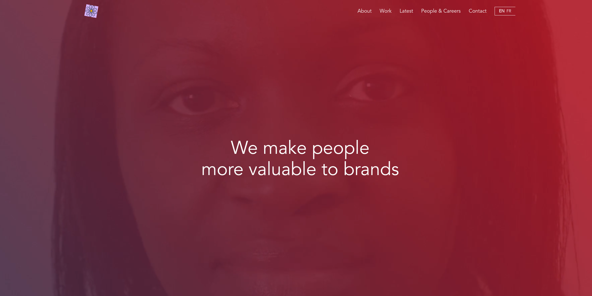

#### A template made from scratch using Vue-i18n for translation



Website is responsive.
MultiLanguage website EN/FR.

# View site live (using netlify)

- https://vuejs-language-template.netlify.app/

## To setup project

```
npm install
```

## To run project

```
npm run dev
```

# Requirements

- Vue 3
- Vite
- TailwindCSS 3

### Vue-i18n for translation
